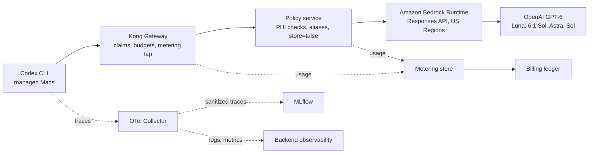

# Healthcare AI Coding Platform Rollout

[](https://github.com/chief-builder/codex_rollout_healthcare/actions/workflows/ci.yml)

An executive rollout plan, published as a static site, for a governed AI coding
platform in a regulated healthcare organization: Codex CLI on managed macOS
endpoints, Kong as the policy and metering gateway, a coding policy service,
and OpenAI GPT-6 models on Amazon Bedrock Runtime, with request-level metering
and sanitized observability. The repository contains the plan (HTML and
Markdown), its diagrams, and automated checks that keep them accurate and
consistent. It does not contain an implementation of the platform.

[Live plan](https://chief-builder.github.io/codex_rollout_healthcare/) ·
[Executive HTML](codex_rollout_healthcare.html) ·
[Consolidated technical plan](healthcare-ai-platform-consolidated-plan.md)

## Why it matters

Healthcare organizations want AI coding assistance, but a general-purpose AI
channel conflicts with PHI rules, audit requirements, and cost control. This
plan shows one way to adopt it with explicit boundaries: only Software
Engineering and Product Manager job families, coding workflows only, identity
from validated token claims, no PHI until a separate approval, a zero data
retention requirement on Bedrock, request-level billing, and phase gates with
named approvers.

## Architecture



| Path                                          | Contents                                                     |
| --------------------------------------------- | ------------------------------------------------------------ |
| `codex_rollout_healthcare.html`               | Executive presentation (the published page)                  |
| `healthcare-ai-platform-consolidated-plan.md` | Detailed technical plan; the source of the control decisions |
| `index.html`                                  | Redirects the GitHub Pages root to the executive page        |
| `assets/*.svg`                                | Diagram sources, used directly by the page                   |
| `test/`                                       | Unit, content, and browser rendering tests                   |
| `scripts/lib/content.mjs`                     | Pure helpers the tests use to check links and consistency    |
| `scripts/build-site.mjs`                      | Copies only the published files into `_site/`                |
| `scripts/lint-markdown.mjs`                   | Runs markdownlint over tracked Markdown                      |
| `AUDIT.md`                                    | Repository audit from 2026-10-02                             |

## Quickstart

Requires Node.js 24 LTS (see `.nvmrc`) and git.

```sh
git clone https://github.com/chief-builder/codex_rollout_healthcare.git
cd codex_rollout_healthcare
npm ci
npx playwright install chromium   # on Linux: npx playwright install --with-deps chromium
npm run check
```

`npm run check` runs lint, format check, type check, and all tests. To view the
site, open `codex_rollout_healthcare.html` in a browser, or run `npm run build`
and serve `_site/`.

## Configuration

There is no runtime configuration; the site is static HTML. The checks are
configured by these files:

| File                     | Purpose                                                          |
| ------------------------ | ---------------------------------------------------------------- |
| `.nvmrc`                 | Node.js major version (24) for local use and CI                  |
| `package.json`           | npm scripts, `engines.node`, and pinned dev dependencies         |
| `.htmlvalidate.json`     | HTML lint rules (recommended preset, aligned with Prettier)      |
| `.markdownlint.json`     | Markdown lint rules (line length and a few style rules disabled) |
| `.prettierignore`        | Files excluded from formatting                                   |
| `tsconfig.json`          | Type checking of the `.mjs` scripts and tests via JSDoc          |
| `test/render.test.mjs`   | Expected page title, section count, required text, and viewports |
| `scripts/build-site.mjs` | List of files published to GitHub Pages                          |

## Tests

| Command                 | What it does                                                          |
| ----------------------- | --------------------------------------------------------------------- |
| `npm test`              | Runs all tests with the Node.js test runner                           |
| `npm run test:coverage` | Same, with a coverage report for `scripts/`                           |
| `npm run lint`          | html-validate on both HTML files and markdownlint on tracked Markdown |
| `npm run format:check`  | Prettier check (`npm run format` fixes)                               |
| `npm run typecheck`     | `tsc` over the scripts and tests                                      |

The tests cover three levels:

- **Unit** (`test/content.test.mjs`): link extraction, alt-text detection,
  local-path detection, alias-table parsing, and date parsing, with positive
  and negative cases.
- **Content** (`test/repo.test.mjs`): every relative link and image resolves,
  every image has alt text, no tracked file contains an absolute local path,
  and the HTML and Markdown plans agree on model aliases and on the
  vendor-facts verification date.
- **Rendering** (`test/render.test.mjs`): Chromium renders the page at 1440 px
  and 390 px with no console errors, no broken images, no horizontal overflow,
  and the expected title, sections, and text.

CI also checks every internal and external link with lychee.

## Project status and limitations

- This is a plan, not an approval. PHI use stays prohibited until BAA
  coverage, HIPAA eligibility review, logging controls, route policies, and
  security signoff are complete.
- No platform code is included. Kong configuration, the policy service, and
  metering are described, not implemented, so the plan's own test plan has
  nothing to run against here.
- Vendor facts (model IDs, endpoints, regions, API behavior) were verified
  against official AWS, OpenAI, Kong, and MLflow documentation on 2026-10-02.
  They change often; revalidate them before any implementation gate. Items
  the official sources did not document are listed under "Open Validation
  Items" in the technical plan.
- The HTML and Markdown plans are maintained by hand. The tests check the
  shared facts (aliases, model IDs, verification date), not every sentence.

## License

[MIT](LICENSE)
